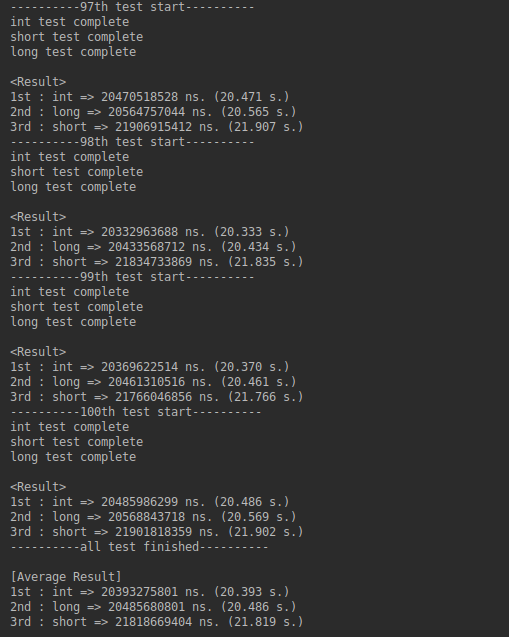

# Result of type_test
-----------------------

### 1. Settings

|Config|Details|
|------|-------|
|CPU|Intel i7-7700HQ|
|RAM|Samsung DDR4 8G PC4-19200 * 2|
|OS|Ubuntu 18.04.2 64-bit (Linux 5.0.1)|
|IDE|CLion 2019.1.4|
|CMake|Cmake 3.14.3|
|gcc|gcc 7.4.0|

### 2. testing purpose

> In programming languages with static types such as C language, "int" is usually used to declare an integer type of data. Since modern operating systems are 32-bit or 64-bit operating systems, "int" is a 4-byte data type. However, we usually use "int" instead of "short" when using an integer of 1,000 or so, which is not very expensive. What we learned is that this is a waste of memory space, why would we do this? Looking at the information, "int" is the data size that the operating system can most effectively use. So I decided to test whether "int" would really be faster than "short". Also, I decided to compare why "int" is 4-byte instead of 8-byte on 64 bits with the 8-byte integer data type "long."

### 3. testing method

> Make a simple operation with three data types: "int" "short" and "long". It will do 100 million iterations for each data type. This is repeated enough times. I repeat 100 times, so I will do 10 billion operations each. Since it is not reliable to do so once, repeat it several times to get the average. In my case, this value is 100.

### 4. Result

- "int" is faster than "short" and "long."
- The difference between "int" and "short": 1 second on average.
- The difference between "int" and "long": 0.1 second on average.
- (Additional result: "long" is faster than "short".)
- Conclusion will write later.